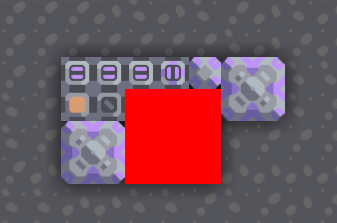
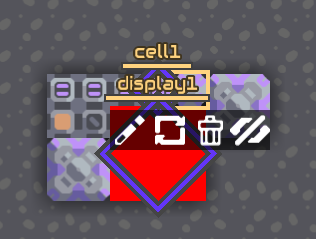

# SBBus

Шина переключателей на 32 канала для Mindustry 7+. Проверено и работает в кампании и на сервере.

Также существует быстрая **мини версия на 4 канала**. Информация в самом низу этой страницы.

- Установите панель
- Подключите шину состоящую из ячейка_панели-ячейка-передатчик-ячейка-передатчик-ячейка...
- Подключайте к ячейкам модули вроде считывателя и клиента.

## Пример


1. Настройки панели
   - 1МЕДЬ выключен
   - 1СВИНЕЦ включен
   - 2СТРУЧОК выключен
   - 2ВЗРЫВНАЯСМЕСЬ включен
3. Настройки клиента
   - 1 клиент установлен на 1МЕДЬ и постройки подключенные к процессору 2 выключены
   - 2 клиент установлен на 1СВИНЕЦ и постройки подключенные к процессору 2 включены
   - 3 клиент установлен на 2СТРУЧОК и постройки подключенные к процессору 2 выключены
   - 4 клиент установлен на 2ВЗРЫВНАЯСМЕСЬ и постройки подключенные к процессору 2 включены

## Панель

2 группы по 16 каналов.


s1:


```
bXNjaAF4nFWTe0gUURSH78zOax8+sDTIAjOCyrakMqKQylSsKNDECLFY10E3dp1ld83c/kiwFxUtCwZBgqEIi0ukPS1dCpIiRZtFDFEKIigNIspXhC3NPfcgNMMwzHd/fHPmzLlEIVYTEeodHpWk6e16jx7TH+v98RtZxwsKGvzEWqP6nT6XN+DS6gkhkttRrbr9RKj0NFVJRPI3ugLOOuOu+QKqj1idmter+uyNDrebpLi1WpfT7vVpTtVvBIjVo3o0X5PdqRqrsseAjlrVkB4h9LBwhDNunEiIAoBHYhLhybgE4ETEBWk5KiNRRJbgUMeBzgyER0J1xpNxCSwq4oK0HJWRKBCFdwPhQWcBwiOhOh5OgZUp4oK0HJWRKCL7DBPqTKCzAuGRUJ2JapnOhDoT6FhURqJAlJ7mZFrnubai0cr6ltzUS58OTXanR72NzSN/7denpZKe1WVXsmxDFc/HImWZwSzzV3Fm1paIpYU17fx4d+7vR7HonW15FyZfTr1u3zN+cl9f4mxf79FnDU8sx+79elUxvzBxZina4j+xuNDb/3B0Zso7uSVq2Tv2fu3YYGQk0PVmxrG7OtI2n3Ce3jXRtoof+F516stwTdLAH/+HHwvBpcz7Kbd/Hi78XDKYXZidk30rL/x2RXh4R+nd2Rxtse5qaldph62s/GJG+vriDZHSTb7yyx/fdazJ796vhc3xzp3B1gOha3pn9VxEiA13rMzffDA0FO+0zGUUrQu2Foe2T1cluKc3v42yAYHmCNBZGxAeCe2sAL8JOitgZwXoLIvKSBSRzZqIOhF0SUB4JFQn0t/NdCLqRNCxqIxEgajxQjpeRpBYBI5s/G+zxVv0F/FmAzzQ+w0U0/viIbYDt9JBxzokqCMZCI+E1iHRcWN1SFiHBHWwqIxEgaixW1Angy4FCI+E6mQ6s0wno04GHYvKSBSI/gMdMdFn
```

```
set p 0
getlink link p
sensor result link @enabled
op sub temp1 p 1
write result cell1 temp1
op add p p 1
op add temp2 @links 1
jump 1 lessThan p temp2
```

## Считыватель


s1:


```
bXNjaAF4nGNgYmBmZmDJS8xNZZC9sPBi+4UdF5sudl/YdGHDxaYLWy/svtijEOzkVFqsx8CdklqcXJRZUJKZn8fAwMCWk5iUmlPMwBKdWxnLxMCfk5+emaxbUJSfnFpcnF/EwJ4LpBPTU4FKmRlAgA+IUyvmmPYG8jUb8Dhzx2ss/yD4omzq38VdadrBCYGX78332KB/+/w0mxYBscdsR32mBrulvr60YZNHy6RrbzPMl8xXevom2nVJ/v1YhZxvWi8LvtXEfN5eon1jr4d83xNx5xn/Lv6tYKr4qhzKwAi0iomFkcEFr48ULsy/sO/Clgu7gGJ9EHUXtioAqUYgYx9QYO+FHRd26QFNYwSb1pBXmpMzkJgBAIn1vbs=
```

```
set p 0
read result cell1 p
print result
op add p p 1
jump 1 lessThan p 32
printflush message1
```

## Передатчик


s1:


```
bXNjaAF4nGNgYmBmZmDJS8xNZZC6MP/C1osNF7Ze2HJhw8Wmi+0XdlzYpRDs5FRazMCdklqcXJRZUJKZn8fAwMCWk5iUmlPMwBKdWxnLxMCfk5+emaxbUJSfnFpcnF/EwJ4LpBPTU4FKmRhAgA+IiyrmuPbd5TxswNNyN9y3UPnKWSZJJe4ZXk/8PVufXjDcVZTkrNFU/ePHjsvKLR+KNQ1cpJa+2LM+IzHE8LFnpJByt3zUB7GrHMvy53Xf2fDTR945yW2vx+mNklYrdvAH39K/tjfv8K0o40f3Db5sPfGySnOOMZveEgZGkAtYGBnycPtNjwsotw8ovuvC7ot9IJmLTRe2KgCpRiBjH1BgL0ixjsKF7SCtQCP2KFzYj03HpovdF1tBEnoMAJy8pQ0=
```

```
set p 1
getlink link p
set d 0
read result cell1 d
write result link d
op add d d 1
jump 3 lessThan d 32
op add p p 1
jump 1 lessThan p @links
```


## Клиент

2 группы по 16 каналов.



s1:


s2:



s3:


```
bXNjaAF4nGNgZ2BhZmDJS8xNZRC6MOvC7gs7Lmy9sPdik0Kwk1NpMQN3SmpxclFmQUlmfh4DAwNbTmJSak4xA0t0bmUsGwN/Tn56ZrJuQVF+cmpxcX4RAxuQKEktYmDPBfIT01MZeCEqUjKLC3ISKxm4c1Nz84sqdZNTc3IY+HMzk4vykXQzMHAxgAAfAwPjxYo5tVOj824biLjMdJf/oLWDkfnZ1cUv4+t2CUQl5YhtWTFJhElf35o7OJZ9qYnWF+Uu46bzsn016keub89oe9H85s+HJH+vZ79Tmiad/9wcu9F3j+/82/uXn9bItvzx5fX5JXefZ3/6ZzFrwlvPV/v41dwqZ1zVDbBe/Ntpddpb4QtxPpfUlyfr8JhIX2G08HPsT5/tk7jihsMBga8B/+bMOjojZLfTnQ0SjWqzvyQs907MuNmQcflm+9J/x9eoH5HazRO9Yn4Er+PazZWBL+o3yW3sq3zH4FC4pWXC8c19af8X9R8sW9rtrHZEdnmBUfXbOfunqfHtavqwmD/N/tfRyEcrtE0aH7Nf3Pd5+kX/7guiy+MOesY0+502XmrxK8uUvak3YE7N1lkMC/0K3n3lmrstaqHFn6pWP+mtATL1e5vULnA/epDNs0eDrfCB6aHWswp+ux1PrJA6EmnOUXGX91GHtAf3Kcc5Bc0N5rcc5xQ1bzC/7TinrPvCdiCvnPtjonUHc/5Fjn+X+159s2yf7PB2xRW9J8a6n5OKPMuOWe7KfbfJlPX9EskvF2fGHQufvWvzrk5++evvTJ+U/3sd/nOhwKPAmsf/1+7ZsV/X487To9/vHZM5E/r0d/XHp+u9bTray1WPx8xlYARGLRMrKIKZgJiZhZGBxVDX0AwozggSYQJSIEFWQ3NdYyMGZiBkBIkygUU3XJhxYe+FLcDkuevChotNF/ZdbIAkUT2uC/Mv7APK7Lqw+2LfxfYLGy7sBMpvVTBUuLD/YgNQYduFrRcbLzaCtVzYpXCxA2jI3gtbcWo0xqWxGSy+4cImoIZ+YDbZc7H7wh6gMFBRE0gDUD+QBZTecGGPHgML2AsMrCAGMEUzlFTMSU5JSHih5+XrE6jhpat3VjPQw+/sScMQgwentM7qBhiEnTitX6ir43um0VO6YKmI6jRtledL1MQ0JWbO0pI4oODSrtnG55wiy3ai6oBQpuXSo5JcmjOPslp2Tm2LcXhuYLihSfbjf/sJhxkn//z//789w4UCs/MMIAcwgawvqJij23uRt9mAx2Uuf53N0V4G6ZIOvQlC3Ld2eYq0f+XmXDA552RV3fOOEz5aRmpxS15Z1xX2nXGtcRC8vSVJ7Cqn8nnNa5NEhP56q8a8ONtjO8eohuPs9d75b6+LhZyZt7r/7bcX8sfWXrtYEPXdfiezi7GWLAMAfs3/1w==
```

s1

```
sensor config1 sorter1 @config
sensor config2 sorter2 @config
jump 4 notEqual config1 @copper
set address 0
jump 6 notEqual config1 @lead
set address 1
jump 8 notEqual config1 @metaglass
set address 2
jump 10 notEqual config1 @graphite
set address 3
jump 12 notEqual config1 @sand
set address 4
jump 14 notEqual config1 @coal
set address 5
jump 16 notEqual config1 @titanium
set address 6
jump 18 notEqual config1 @thorium
set address 7
jump 20 notEqual config1 @scrap
set address 8
jump 22 notEqual config1 @silicon
set address 9
jump 24 notEqual config1 @plastanium
set address 10
jump 26 notEqual config1 @phase-fabric
set address 11
jump 28 notEqual config1 @surge-alloy
set address 12
jump 30 notEqual config1 @spore-pod
set address 13
jump 32 notEqual config1 @blast-compound
set address 14
jump 34 notEqual config1 @pyratite
set address 15
jump 36 notEqual config2 @copper
set address 16
jump 38 notEqual config2 @lead
set address 17
jump 40 notEqual config2 @metaglass
set address 18
jump 42 notEqual config2 @graphite
set address 19
jump 44 notEqual config2 @sand
set address 20
jump 46 notEqual config2 @coal
set address 21
jump 48 notEqual config2 @titanium
set address 22
jump 50 notEqual config2 @thorium
set address 23
jump 52 notEqual config2 @scrap
set address 24
jump 54 notEqual config2 @silicon
set address 25
jump 56 notEqual config2 @plastanium
set address 26
jump 58 notEqual config2 @phase-fabric
set address 27
jump 60 notEqual config2 @surge-alloy
set address 28
jump 62 notEqual config2 @spore-pod
set address 29
jump 64 notEqual config2 @blast-compound
set address 30
jump 66 notEqual config2 @pyratite
set address 31
read result cell2 address
control enabled switch1 result 0 0 0
write result cell1 0
```

s2

```
read result cell1 0
jump 3 notEqual result 0
draw clear 255 0 0 0 0 0
jump 5 notEqual result 1
draw clear 0 255 0 0 0 0
drawflush display1
```

s3

```
set p 1
getlink link p
read result cell1 0
control enabled link result 0 0 0
op add p p 1
jump 1 lessThan p @links
```

## Мини версия на 4 канала (SBBus Mini)

По быстрой версии шины SBBus (SBBus Mini) сигнал проходит путь в 22 передатчика (повторителя) за 2 секунды.


### Панель

```
bXNjaAF4nGNgYWBmZmDJS8xNZRC/MP/Chgt7L2y9sPtij0Kwk1NpsYJvZl4mA3dKanFyUWZBSWZ+HgMDA1tOYlJqTjEDS3RuZSwrA1txeWZJcgaQzi8qSS1i4M/NTC7K1y0oyk9OLQaKMbDnAunE9FQG7tzU3PyiSt3k1JwcoDncDCDAxcjACKQYWUEcJhDmAxIzK+a49t3mbTbgcfUVXDVF08bJ2ZrBuYRRLsxT2kmEfaPX8largCP9S4vfb3zKw7DPR9D23pXuRabvmm9/6Dr5UcJAwN/sXaLrujyd0qwvJ4KbJ7KtTw1fbTnDo/32pK1V+pMjy+danPzlnOW15pLntC+2vEGLVJ+lx1sbmjuezGcVuW14gnWdzewb36QSYvk0FK0f8k0Xlpuw/jT/oiyPfJBboa5mBLuakYEZiJlYGBl0UQLwYvOF/RcbgAKbLuwGCu29sONiP1Ko6kG8CzaICWwQyPPMUBFmsAgwZoAYKA4Ah0+ItQ==
```

```
set p 0
getlink link p
sensor result link @enabled
op sub temp1 p 1
write result cell1 temp1
op add p p 1
op add temp2 @links 1
jump 1 lessThan p temp2
```

### Считыватель

Остался таким же.

### Передатчик

```
bXNjaAF4nGNgZGBiZmDJS8xNZZC/MP/C1osNF7Ze2HJhw8Wmi+0XdlzYpRDs5FRarOCbmZfJwJ2SWpxclFlQkpmfx8DAwJaTmJSaU8zAEp1bGcvEwJ+bmVyUr1tQlJ+cWlycX8TAngukE9NTgUqZGECAD4iLKua49l3kbTbgcbkc71+obLKI2YCF22Urq4jzWosV0SVpHiotOnePX748V16xZb93o+IlDdfnuY7ci7sk/U9Nkoisud60fYWbwd9PMU+azqb/khIyfuX6683qhc1dvw2Wvk1Z773B7FpLBXfbvm8Wc+VbmdnP6BUxMALtZWRhZCgm4EE9LqCCfUDJXRd2X+wDSV9surBVAUg1Ahn7gAJ7QTp0FC5sB+kHmrNH4cJ+bDo2Xey+2AqS0GMAAH73pe8=
```

```
set p 1
getlink link p
set d 0
read result cell1 d
write result link d
op add d d 1
jump 3 lessThan d 4
op add p p 1
jump 1 lessThan p @links
```


### Клиент

```
bXNjaAF4nGNgYmBmZmDJS8xNZRC/MOvC7gs7Lmy9sPdik0Kwk1NpsYJvZl4mA3dKanFyUWZBSWZ+HgMDA1tOYlJqTjEDS3RuZSwLA39uZnJRvm5BUX5yanFxfhEDG5AoSS1iYM8F8hPTUxm4c1Nz84sqdZNTc3KA+lkZQIAPiNdWzEm9cJbrkAEPw4MwgYX+E1dvL3U+Mltcfsm6wtkpubnW3365vT5gWHTy/HQRrdYJx1v0fnKsLe9fyOxn7MZ7PWj1cxO2jAM/a6p928SOPRYwWNUi2bNVMLhp1YPLYsJSuxftuvB5Wt8MX3e1pVPXd+/PqRX3fdHeo31vxQl9pufCqRkTV8SldYkXf2F5cWbuBadZ7Xe+VR28qn5F5ueT//ueLRNIUv9238uj7/D79Tv077On5JxjYAQ6mRHseiYQZmFkmIUjyPS4Lsy/sO/Clgu7Luy+2Hex/cKGCzsvNl3YqmCocGH/xYYL+y62Xdh6sfFiI5DVoHBhl8LFDqApey9sxanxYjNY44YLm4AS/UAL9wCVbQVpNcJi5MVmPZBbIaGcUzFHt/cub4MCT8vDg9P9CpVfsPE9ZNLorRflOPqX1XT6lunPfs01PbaiyPGQg7b4zcOd5Sqn3tgYvdZl5e7meZHZufCJxoMHaYn/Xf/73HcxPFgZX9lbcSc8ViBsrpn4q9wcea+t12a9W2r2m8HWVkOBgRloLdBiADvMFwY=
```

s1

```
sensor config sorter1 @config
jump 3 notEqual config @copper
set address 0
jump 5 notEqual config @lead
set address 1
jump 7 notEqual config @metaglass
set address 2
jump 9 notEqual config @graphite
set address 3
read result cell2 address
control enabled switch1 result 0 0 0
write result cell1 0
```

s2

```
set p 1
getlink link p
read result cell1 0
control enabled link result 0 0 0
op add p p 1
jump 1 lessThan p @links
```

## SBBus 256

256 каналов.


генерация клиента

```
for (let j = 0; j < 16; j++) {
  console.log(['copper', 'lead', 'metaglass', 'graphite', 'sand', 'coal', 'titanium', 'thorium', 'scrap', 'silicon', 'plastanium', 'phase-fabric', 'surge-alloy', 'spore-pod', 'blast-compound', 'pyratite'].map((elem, i) => `jump ${18+j*16*2+(i*2)} notEqual config${j+1} @${elem}__LLOLOLO__set address ${j*16+i}`).join('__LLOLOLO__')) // ЗАМЕНИТЬ __LLOLOLO__ на переаод строки
}
```

## Панель

```
bXNjaAF4nGXYCXCUhRnG8Q1737vfud/eu1HTioJQafGAVpQI7YAzKPVAw8CaaoZAIAEBNcooDqABhonHWCiRo0M9aqSWemDQgg14DE1oabDEWuUKtFLGRjLCMHbzPQ8vVtupL8NP8Puv29V9HBc50k6Ha86M2bUOo6ut65Wujq5tXdu7W/I3jxu3oCk/ctQPHcG7a5tKjXVz59c1zHE4HJ76GTNr65scrmmzF9/ldQRLDXPn1jZevnBGfb3D07Swbn7p3vJtaJxf2+gI19fNW1B39+VNDQsaS7WO6L2LB//UuY0Npdqm8p/iCM6und3QuPjymTPmzHJ4Z5d/csY9tQ6Hc7njwn8qcIbgOHFcOG4cD44Xx4fjxwngBHFCOGGcCE4UJ4YTx1FwVBwNR8cxcEychDxlxeB/AxXlZy3/z33+8Z0AF8Et4AF4CT4BPyBACAqEAGFCRCAKiBHiAgpAJWgCOsAIOGwwBRLyatu/xP6FQ+ycChucABfBLeABeAk+AT8gQAgKhABhQkQgCogR4gIKQCVoAjrAIJgCdo7z/N8J5DjtnCE2OAEuglvAA/ASfAJ+QIAQFAgBwoSIQBQQI8QFFIBK0AR0gEEwBewcF3JczHHZOU4bnAAXwS3gAXgJPgE/IEAICoQAYUJEIAqIEeICCkAlaAI6wCCYAnaOGzlu5rjtHJcNToCL4BbwALwEn4AfECAEBUKAMCEiEAXECHEBBaASNAEdYBBMATvHc/7/3cjx2DluG5wAF8Et4AF4CT4BPyBACAqEAGFCRCAKiBHiAgpAJWgCOsAgmAJ2jhc5XuZ47RyPDU6Ai+AW8AC8BJ+AHxAgBAVCgDAhIhAFxAhxAQWgEjQBHWAQTAE7x4ccH3N8do7XBifARXALeABegk/ADwgQggIhQJgQEYgCYoS4gAJQCZqADjAIpoCd4z//Twzk+O0cnw1OgIvgFvAAvASfgB8QIAQFQoAwISIQBcQIcQEFoBI0AR1gEEwBOyeAnABzAnaO3wYnwEVwC3gAXoJPwA8IEIICIUCYEBGIAmKEuIACUAmagA4wCKaAnRNETpA5QTsnYIMT4CK4BTwAL8En4AcECEGBECBMiAhEATFCXEABqARNQAcYBFPAzgkhJ8SckJ0TtMEJcBHcAh6Al+AT8AMChKBACBAmRASigBghLqAAVIImoAMMgilg54SRE2ZO2M4J2eAEuAhuAQ/AS/AJ+AEBQlAgBAgTIgJRQIwQF1AAKkET0AEGwRSwcyLIiTAnYueEbXACXAS3gAfgJfgE/IAAISgQAoQJEYEoIEaICygAlaAJ6ACDYArYOVHkRJkTtXMiNjgBLoJbwAPwEnwCfkCAEBQIAcKEiEAUECPEBRSAStAEdIBBMAXsnBhyYsyJ2TlRG5wAF8Et4AF4CT4BPyBACAqEAGFCRCAKiBHiAgpAJWgCOsAgmAJ2Dr8lxe1/yy6fIThOHBeOG8eD48Xx4fhxAjhBnBBOGCeCE8WJ4cRxFBwVR8PRcQwcE8d+XH6bU/C4Ch5XweMqeFwFj6vgcRU8roLHVfC4Ch5XweMqeFwFj6vgcRU8roLHVfC4Cv76Ch5XweMqeFwFj6vgcZXBxx38XmC57X+Xx68of3/j20aV75Uq3jYq3zaqfK9U8bZR+bZR5XulireNyreNKt8rVbxtVL5tVPleqeJto/Jto8r3ShVvG5VvG1W+V6p426h826jyvVIdDCt/JXAkyy+Tc++idZP2T5uTnupY+mlp3ISRd/7tip/1Nf3rg2nGHz31vcXJ61YcyQ6dNmPZ05dZIc+jhX0b3n9v/v4PJkwfeHbOueH7bywsnf704rc7Dty3tu3Yua8+Ovnx6ePHZr764fYju46cbqx5ee9A2/Ad6xfurjr23+NHd/3pvjeu/ujksQEz/vXKtaufuefsV3NPH140MOyhHe+17t6yZfSum6e/c03d2V+uvnPul5/vf6C3d/2fP/ji0NpDmcljMweWzp2vrf/xmMse3H/Hoq0PXnvw6/5L/nDw9PElf31Ibzw76XufT/7N5ws3NDzsu3672Xl6yxXb3l7yzPSav2/z3lz/8NopZ3c/eXDT879/eNK2c/ecOFj1lyUv755auXOzv/bFKcuu/P7GST9d3jryxOZHrn1+400nuqvCfa3V/RPVMz8/EmmeckPbk11Vtf1jXrq0r/XSM5uzzfuWjK27oe3KDQ1Tj3dVje+f6G+eUt12S1fV1P6JY85srmjet3xs3bhPzl237fo2rbvq4v6JVvOU69pu6a76sq/V0z+x8sxmf/OLZy78zhPdzVPGf/LxC9/4nfd3bbjp8b5W5czmlrHPP3fTC32t9/dPdJ7ZHG/et3TH1NKysSu2N25/fFdx3u0XTX7i3dlrRg9TesZ/9taE3memqgPjP9sxoddccbY4b/pFJ594t3nN68N/9OLrw5WBI5e8dXV9xtu557ERjTNbehOVN3bueWpE4y9aeq3KZZ17fh2v3NK557cjGutb7lw7a01T6fA/EleNrh62ak1r6fDR5Ss2lQ6fSFx1TfXJVWt2lQ5/kbhqTPWc1WsOldbdseu1w+/0PvbPlk/3PHtqzKijpz68fWfP3uT6a86eWtnkG76utOj4up1DS8d3dlq7Xtur7Wg6eqrj1aW5dXrH6pmraw4tqTm0vObQ0pqt9/WNqu5PqvevtDo6H6kpjW/femP7vJ+0z7uhfd649gMLB3Xscn9HZ0tN6br2rRt7DmzqGf1cz+iNPaM33Jq+uj9Zef/Kb+tATbp71rquoasy96+Md3QurSlVt299rue27ln/7p6V7poFnXxB//Or27pmvdQ36nTfqEjfqFV9oyb33fXsm5GOzuU1pXHtIzb1fIsb2+fcWn3yqTUP1B6usd74zg8vvuRbP7GgsrG9pXdo5cD7ezqUHwz+ceSFn/jGD5Xg4B/fNL77W5Z/uOKp7/7ler52vnLlLW86OJBVlA8+pzQZjDR8Tmn8nNJkMNLwOaXxc0qTwUjD55TGzylNBiMNn1MaP6c0GYw0fE5p/JzSZDDS8Dml8XNKk8FIw+eUxs8pTQYjDf+80JGjM0eXwUhHjs4cXQYjHTk6c3QZjHTk6MzRZTDSkaMzR5fBSEeOzhxdBiMdOTpzdBmMdOTozNFlMNKRYyDHYI4hg5GBHIM5hgxGBnIM5hgyGBnIMZhjyGBkIMdgjiGDkYEcgzmGDEYGcgzmGDIYGcgxmGPIYGQM5rjLxxr8Tm84Uq4Kx2X/N1t3P9r1dveS8k/8rmt7+ac6ul7vXn1hyx7m4GpbUT54LUxZm0y8FiZfC1PWJhOvhcnXwpS1ycRrYfK1MGVtMvFamHwtTFmbTLwWJl8LU9YmE6+FydfClLXJxGth8rUwZW0y8beW63OCOQlZmxLISTAnIWtTAjkJ5iRkbUogJ8GchKxNCeQkmJOQtSmBnARzErI2JZCTYE5C1qYEchLMScjalECJhRyLOZasTRZyLOZYsjZZyLGYY8naZCHHYo4la5OFHIs5lqxNFnIs5liyNlnIsZhjydpkIcdijiVrk4WcJHKSzEnK2pRETpI5SVmbkshJMicpa1MSOUnmJGVtSiInyZykrE1J5CSZk5S1KYmcJHOSsjYlkZNkTlLWpiRyUshJMScla1MKOSnmpGRtSiEnxZyUrE0p5KSYk5K1KYWcFHNSsjalkJNiTkrWphRyUsxJydqUQk6KOSlZm1LISSMnzZy0rE1p5KSZk5a1KY2cNHPSsjalkZNmTlrWpjRy0sxJy9qURk6aOWlZm9LISTMnLWtTGjlp5qRlbUojJ4OcDHMysjZlkJNhTkbWpgxyMszJyNqUQU6GORlZmzLIyTAnI2tTBjkZ5mRkbcogJ8OcjKxNGeRkmJORtSmDnCxysszJytqURU6WOVlZm7LIyTInK2tTFjlZ5mRlbcoiJ8ucrKxNWeRkmZOVtSmLnCxzsrI2ZZGTZU5W1qYscnLIyTEnJ2tTDjk55uRkbcohJ8ecnKxNOeTkmJOTtSmHnBxzcrI25ZCTY05O1qYccnLMycnalENOjjk5WZtyyMkjJ8+cvKxNeeTkmZOXtSmPnDxz8rI25ZGTZ05e1qY8cvLMycvalEdOnjl5WZvyyMkzJy9rUx45eebkZW3KI6eAnAJzCrI2FZBTYE5B1qYCcgrMKcjaVEBOgTkFWZsKyCkwpyBrUwE5BeYUZG0qIKfAnIKsTQXkFJhTkLWpgJwicorMKcraVEROkTlFWZuKyCkypyhrUxE5ReYUZW0qIqfInKKsTUXkFJlTlLWpiJwic4qyNhWRU2ROUdamInIqHQ6cCpwhOE4cF44bx4PjxfHh+HECOEGcEE4YJ4ITxYnhxHEUHBVHw9FxDBwTp/y4/wMOmNll
```


```
set p 0
getlink link p
sensor result link @enabled
op sub temp1 p 1
write result bank1 temp1
op add p p 1
op add temp2 @links 1
jump 1 lessThan p temp2

```

### Считыватель

```
bXNjaAF4nGNgYWBmZmDJS8xNZVC4sPBi+4UdF5sudl/YdGHDxaYLWy/svtijEOzkVFqsYGRqxsCdklqcXJRZUJKZn8fAwMCWk5iUmlPMwBKdWxnLzMCbk1lYmpmiW5xfWpScysCem1pcnJieysCfUVmQWqRbUJSfDBTJLwLqZGYAAVag5QyMQAYTCyPjhLzSnJxRPHgwAxMQMvIBoye9Yo5p70FeJ0Me58vSp0TkGpUOqvA4BDDLv9APvLyO34XJb9r8+U9cXNSvMx6ettvLMXx+6QOdtxMTc/5eO8b/6bLC0pbsEzXzs1lW7ZIXzzxY9vvw9f1XXnJfi3iyauZj5YvP4u/re8kvcFBtZQAA23IKuA==
```

```
set p 0
read result bank1 p
print result
op add p p 1
jump 1 lessThan p 256
printflush message1
```

### Передатчик

```
bXNjaAF4nGNgYWBmZmDJS8xNZZC7MP/C1osNF7Ze2HJhw8Wmi+0XdlzYpRDs5FRarGBkasbAnZJanFyUWVCSmZ/HwMDAlpOYlJpTzMASnVsZy8zAm5NZWJqZolucX1qUnMrAnptaXJyYnsrAn1FZkFqkW1CUnwwUyS8C6mRmAAFWoNUMjEAGEwsjQxF+u/W4gPL7gHK7Luy+2AeSvdh0YasCkGoEMvYBBfaCNOgoXNgO0g40Zo/Chf3YdGy62H2xFSShx8AEhIx8QAeUVsxx7bvI22zA43J4/fIdgh6BP9M69CacClvYknDUMXax8nQXp6lLf1dU7Sp+Puf3LBENm71LjqiuzVgYYrh4uU7jxKN9ER94Mr8m/Hqy9ATr7PNbtJmMX1VWyc9OchDZfFzm0sm87x+Dtpw1Pfpf9GjI7J5z8+/wx3Ho3WQAAL4YsR0=
```

```
set p 1
getlink link p
set d 0
read result bank1 d
write result link d
op add d d 1
jump 3 lessThan d 256
op add p p 1
jump 1 lessThan p @links
```


### Клиент

```
bXNjaAF4nHVWaSCUaxt+zbzM2BrLJEmIk+0YjFDKNnGQlLFUkmSMUSMyjXUsFZpEtiyD0nAyYlTIUnNs2Vqm0TFK6JSsZalBarJk+V758Z0/5/1zP+91Pfd9X9fz6wIQgDgcAM8RgkiAAv8Gv4HP4dfxm7rj1dz27w8LUTMyMQUk/UghRCqZEkoOPgcAgFggwZcUGAKAJ4JoJ5GAdCD5fBjZDxMSHEYlkgBEECkkhHCaBIiFBFNDSVQAdYZGIVExFGowEWKCISCITKQG/wuQDCIFBVNpGCIpMBBABQafJhP/xUpvAH7kEEoggQbt3wKsf6IgAAdEoIMIKALU8vP4TfxaSHs9v6o7nt/cfen/+vUl+IX8Zoit5zd0p3Un8qv4f0F36tSwavzH3Zegy1f4dd1x3XG/2vj1at1XoUFN/Lr/bNz1X40Jv/AqfjXUkA69Y2P3NX4jBEOX4tcboH7oBNFV/EZ9ALZuA/hVxDYKYqMgRdcdwqGzyCYAECdHFtBvDmRuM5Gh3xrRcueMSC/D2DfO1Rm/2r7b/GoNlhtfY/rwkWujOYHxJh8TXKjwRFqeDb/fy46JDp3zr9GxOvUDlTtKi46IWVhZzQrMvfh4uqt6Rbi45cOA3tlTR5sLlqgjvN7cVIPx5oJF6iSPbtAVS/vEqzM41vx+iTrKMxr2uuPTHkVp5YqnHY6vkVdmgqVaeyzF/3amXJIrKBpCfvwotRa5TP3HccBSufLxipCz7968z1vKXkEXb4YyMG15wXzGIFfwvfGkVvVK1WBs41u92JrMl6d+9A2Utk9T/2LzvQmskde0iKWYiwODaJY33qGVNE/5uUaM3TUTFsF5W1C4W6t3UrhaH825uEx1w0eJfP6xtBh5oeni9M/jlbkNJW9vDtTN3En9oDqdm35z5f7M6SYmI0RL2kG14gHDuTAid+XnYITq3/MRj47Evni61GzOtBIMzmxKHB189Ecs3+6m1faun/Olo3d5PfZBX0BL87Dvq9MLH0NjYkxCJ912R8ldLIzo64twXJqo2YcouZFhufjlsHW+9tL7mrMnNY44qF4Iv39WTXJytKuCvLOeb7nQtu3CTikB3ODeyXIpwWv9eyRNaUGN/j1CpbRAQ7/2hPomgTzzeHvc3lpnmn9Q4hTfUpBfp8K2+dl4+h/LI4k/4rq+IMWmHGK/5zBBN/up0cppZbkj9lPtldOgnIv9VFZlhRDN1hBOHuuLSl7lT4wGV0za9lxfGtoWvJCz11U1kihwDWNZCp56+kNDelNNvrwhxHYYdYcnmTvhWz03fSckq/fStGUOahMF9hJYm80WcF3Zz25bCOOG/Kub0a9GfdQfbN05bZhS3qEr8R6reD3JJDBi5QQrKyV6aPgl7E8/LzCdYpedeV7U/PFWDb2UD69vinpy8xpO7xn15ebVI8yIAVzFh+N7RgO4eXVaZpJvMrHBqFBT/MGn7y36jt9jxHOjq2scMKLF816nberQXrCucIWykiH1yIc8d4xoX4vNSc0AHQ6cOUFlMeKjh9j6COgXqSIwcjnYunnWIzfJU8JuJh9C87ERqHCzhXzQbZ6Sm+/pL/Wu+OQnCD3bFW7mzkuhRbfx4HWdeQ3jjcp3SU/HLCY/OmB22c2YGaDeGI3KRfby4jz9vcCuKHp5yYhS5PPfbTGbI1rkvZN6XM+jzD/mWGM2b2kt9t4RwObAVL5JuBx8MmExuo6GzBcd43jq3pkmVPILh7GB6VH0uyW+vUyhYxnj4Q3je/N4jHR4ammz3N2S1uqv/cfU64w5pszFFxC8Ke1Zs1xZifBaEXPJv5xxFD+URtAMIO962LA67oC5f/up0AoRQJbeWfEtv4xEiI0MbhQco14nC6c8+twNeM6IMsL9Xa3PL3Ojx27m+zJUNfHWPzUzr4vLz3fsRjUapAyEDJpTH2t2Dr4eNJ99rOkl0nUxZOLSIQ7IXP30ACF21tlC5O/rkmJEqB6dTuAGDNbXlHWKJ5SUMn8GTNBbu9y6LphQ24cm2IiWFz1we2eL5SN3VCKjpriVdlNx7FKVtYAiFU7UlGyVq7Cl3w11yQSPem8hBD2IwpZht664MJbKyZXocOSD6JR9Q7SqK1Nxk6VMsc8eFlWrPfKE1B74qLOFrGmFCufClEsVVtgyB/Vg3FHLlkK9fnVhy1c31OVUNiKtMEox0Mlidrkny+daT1bvI+Ve8yMoLyuhQ39ZlM8yG9GmUIaYLoxSD3wQNQSUj7eZuqJSrIWh/WJTcTvyzFUf4i1mwazS9h9WMwbJjlGa7hYU0SytjvH5YwaqHvHcmmG3pD7UcssYd5atJiPT2TL2dZad/Dsy3GcuY8F9bCe4z5C2P2Z6re6KD1JzLmPfH+rxGnnPQ6bRZUiGj3plvXyOrFerrXdYqbV9lZg8rf+W745WFaexpAglHXF9gnpX02trR4qkPE14az+mFes0JohQuibeTFBHtbotMJN4OO+ExV2PW4ycxrB5lsJ2A6ex7Xtiprfk0ZPMQXvnVViD4fVSnx9fDKqgEXB/5zVYuyHNO3ti8dSQoiYqVc4WABmEuSFtYzE1inTWMzvx2wDssyHtXDZOGfhBmPuu3W4LeHWMbXW1+xPgJHHdWB1/AXuSubtYy87GQLPvnLIOYS9QsV5x1gDDdw7QMde4FD086TKSB3R2jIm7trGALx1jWFcPD2sfLc30jLY5GMwGS7uQrW2kRkFnJTqIu8JhB7G0DLSSsgwnmUtkgW9F4uryzO0dlVVl+q9xX7NS5EBYLpZ2Jxt31XrIVNM5R+4TEkwjzjnpjGrH1ZpYdaCulItXFNMq0CraMh5pn+JcPe5YD+1W+pNreFTNcFsqQMrWk+lPtSvKpEuC4cWyTL9FWNzwmcs7i6/GtZw3bsvCvbD2MVPCOSoZ4/PS7CKNripN1D59dmbNRRHxoVi2TPmJNHoTS7ZaGdyEtmPJ1kppICQMXiGPpdkgJGxeIT3tHsDp28iX9Wiz1sO2SjscFSzwnAy7M0ZSqhNK+r9Zb32CCn2pIFfmJwLGcjeLrTTobauAE7jal4vOsjJm/WRs8B4ZdhmZYrJoTZYsU+o2UkLjFdL5KQGkbyGDuvbnQboGNBwRB9KxZBDT7hDfdtO4LWcUH99WZBzPcNHDhaUWLBGHW0H6LvJl7ePGuGHHdesFRZTfIOtoZ7xHJmRdFI1Og8b7yYrSd5Ih6xnxbZnr1p1whAPr1t3xeZnr1nW1Uw5omG9N3Gx8P4kYJfHgxhBeaQcP54MjuCvheIbVRbO6qZSPe2qLDPVSi0joE3hOjt3zTMQW9GGSpi33tqRErpH8Dal2SYlEI/milBFJiWtG8pB1MTouX9y5GpnQVtQJbZdJaCvsvKyVoJjQxuwEdcgZuGFnf0hNNo7gAtXzeTiCqz8sp3hPQhu7c928GP1UvrjnletidGK+OPTy0hJ9RvK1Kb7SN741fKOuPOL1jQ7Xr1RFL7hVLZ3TaWamJwpWCfPDVWucppimxx9iFQKZzFXavLBx+c5CScPKsBrP4JzpzVOmVsvzQsG7Tw0v360+amKkP1pw4N0RtpsGe1vOPbpoajVSrGfy+Vljzz3VMPZxq39cv7V/0lr+WF4y8fEgozzX4OQL7+ZXrvMrS6SDA7xj3lPezS9c5y1WQ6qzm1a2wItpiwAIRUo4lLmA0MgCop+Pz4S+4yEnF21HjP5LHReHwy+5WHfDoRe6LzF4w6PPeQbnMXqHOuMObKOUoHcyfv9tnKWpoKOYf0NXsUXNNlHnyiYbv+1iz6Na5MhmJU+2SujkPxE1S8q54mU9boiltHCk9NbWsFXxt8BsHxB4Cjfqh9KgCCRhPfdtBEORjWAoshEMRQDkelKEbSgMjizApHZLJxhK2d5KX41M3iZi6oNUcEgSrdVMGjG0OlS0l8u4Nx6RdrWTpU4cO1I+/fVatJ/+CDy5n735WlmaYuSBBwxWxsSg7jBurZPfrtOeyI8ZWDBLf1jkaxps+fBdj1XKifvFfUFN+lQrW1NdFWgvbEMVbEMVbEMVbF0VpGmDg29w8A0Ovs4hftkC/gd9/7IU
```

s1

```
sensor config1 sorter1 @config
sensor config2 sorter2 @config
sensor config3 sorter3 @config
sensor config4 sorter4 @config
sensor config5 sorter5 @config
sensor config6 sorter6 @config
sensor config7 sorter7 @config
sensor config8 sorter8 @config
sensor config9 sorter9 @config
sensor config10 sorter10 @config
sensor config11 sorter11 @config
sensor config12 sorter12 @config
sensor config13 sorter13 @config
sensor config14 sorter14 @config
sensor config15 sorter15 @config
sensor config16 sorter16 @config
jump 18 notEqual config1 @copper
set address 0
jump 20 notEqual config1 @lead
set address 1
jump 22 notEqual config1 @metaglass
set address 2
jump 24 notEqual config1 @graphite
set address 3
jump 26 notEqual config1 @sand
set address 4
jump 28 notEqual config1 @coal
set address 5
jump 30 notEqual config1 @titanium
set address 6
jump 32 notEqual config1 @thorium
set address 7
jump 34 notEqual config1 @scrap
set address 8
jump 36 notEqual config1 @silicon
set address 9
jump 38 notEqual config1 @plastanium
set address 10
jump 40 notEqual config1 @phase-fabric
set address 11
jump 42 notEqual config1 @surge-alloy
set address 12
jump 44 notEqual config1 @spore-pod
set address 13
jump 46 notEqual config1 @blast-compound
set address 14
jump 48 notEqual config1 @pyratite
set address 15
jump 50 notEqual config2 @copper
set address 16
jump 52 notEqual config2 @lead
set address 17
jump 54 notEqual config2 @metaglass
set address 18
jump 56 notEqual config2 @graphite
set address 19
jump 58 notEqual config2 @sand
set address 20
jump 60 notEqual config2 @coal
set address 21
jump 62 notEqual config2 @titanium
set address 22
jump 64 notEqual config2 @thorium
set address 23
jump 66 notEqual config2 @scrap
set address 24
jump 68 notEqual config2 @silicon
set address 25
jump 70 notEqual config2 @plastanium
set address 26
jump 72 notEqual config2 @phase-fabric
set address 27
jump 74 notEqual config2 @surge-alloy
set address 28
jump 76 notEqual config2 @spore-pod
set address 29
jump 78 notEqual config2 @blast-compound
set address 30
jump 80 notEqual config2 @pyratite
set address 31
jump 82 notEqual config3 @copper
set address 32
jump 84 notEqual config3 @lead
set address 33
jump 86 notEqual config3 @metaglass
set address 34
jump 88 notEqual config3 @graphite
set address 35
jump 90 notEqual config3 @sand
set address 36
jump 92 notEqual config3 @coal
set address 37
jump 94 notEqual config3 @titanium
set address 38
jump 96 notEqual config3 @thorium
set address 39
jump 98 notEqual config3 @scrap
set address 40
jump 100 notEqual config3 @silicon
set address 41
jump 102 notEqual config3 @plastanium
set address 42
jump 104 notEqual config3 @phase-fabric
set address 43
jump 106 notEqual config3 @surge-alloy
set address 44
jump 108 notEqual config3 @spore-pod
set address 45
jump 110 notEqual config3 @blast-compound
set address 46
jump 112 notEqual config3 @pyratite
set address 47
jump 114 notEqual config4 @copper
set address 48
jump 116 notEqual config4 @lead
set address 49
jump 118 notEqual config4 @metaglass
set address 50
jump 120 notEqual config4 @graphite
set address 51
jump 122 notEqual config4 @sand
set address 52
jump 124 notEqual config4 @coal
set address 53
jump 126 notEqual config4 @titanium
set address 54
jump 128 notEqual config4 @thorium
set address 55
jump 130 notEqual config4 @scrap
set address 56
jump 132 notEqual config4 @silicon
set address 57
jump 134 notEqual config4 @plastanium
set address 58
jump 136 notEqual config4 @phase-fabric
set address 59
jump 138 notEqual config4 @surge-alloy
set address 60
jump 140 notEqual config4 @spore-pod
set address 61
jump 142 notEqual config4 @blast-compound
set address 62
jump 144 notEqual config4 @pyratite
set address 63
jump 146 notEqual config5 @copper
set address 64
jump 148 notEqual config5 @lead
set address 65
jump 150 notEqual config5 @metaglass
set address 66
jump 152 notEqual config5 @graphite
set address 67
jump 154 notEqual config5 @sand
set address 68
jump 156 notEqual config5 @coal
set address 69
jump 158 notEqual config5 @titanium
set address 70
jump 160 notEqual config5 @thorium
set address 71
jump 162 notEqual config5 @scrap
set address 72
jump 164 notEqual config5 @silicon
set address 73
jump 166 notEqual config5 @plastanium
set address 74
jump 168 notEqual config5 @phase-fabric
set address 75
jump 170 notEqual config5 @surge-alloy
set address 76
jump 172 notEqual config5 @spore-pod
set address 77
jump 174 notEqual config5 @blast-compound
set address 78
jump 176 notEqual config5 @pyratite
set address 79
jump 178 notEqual config6 @copper
set address 80
jump 180 notEqual config6 @lead
set address 81
jump 182 notEqual config6 @metaglass
set address 82
jump 184 notEqual config6 @graphite
set address 83
jump 186 notEqual config6 @sand
set address 84
jump 188 notEqual config6 @coal
set address 85
jump 190 notEqual config6 @titanium
set address 86
jump 192 notEqual config6 @thorium
set address 87
jump 194 notEqual config6 @scrap
set address 88
jump 196 notEqual config6 @silicon
set address 89
jump 198 notEqual config6 @plastanium
set address 90
jump 200 notEqual config6 @phase-fabric
set address 91
jump 202 notEqual config6 @surge-alloy
set address 92
jump 204 notEqual config6 @spore-pod
set address 93
jump 206 notEqual config6 @blast-compound
set address 94
jump 208 notEqual config6 @pyratite
set address 95
jump 210 notEqual config7 @copper
set address 96
jump 212 notEqual config7 @lead
set address 97
jump 214 notEqual config7 @metaglass
set address 98
jump 216 notEqual config7 @graphite
set address 99
jump 218 notEqual config7 @sand
set address 100
jump 220 notEqual config7 @coal
set address 101
jump 222 notEqual config7 @titanium
set address 102
jump 224 notEqual config7 @thorium
set address 103
jump 226 notEqual config7 @scrap
set address 104
jump 228 notEqual config7 @silicon
set address 105
jump 230 notEqual config7 @plastanium
set address 106
jump 232 notEqual config7 @phase-fabric
set address 107
jump 234 notEqual config7 @surge-alloy
set address 108
jump 236 notEqual config7 @spore-pod
set address 109
jump 238 notEqual config7 @blast-compound
set address 110
jump 240 notEqual config7 @pyratite
set address 111
jump 242 notEqual config8 @copper
set address 112
jump 244 notEqual config8 @lead
set address 113
jump 246 notEqual config8 @metaglass
set address 114
jump 248 notEqual config8 @graphite
set address 115
jump 250 notEqual config8 @sand
set address 116
jump 252 notEqual config8 @coal
set address 117
jump 254 notEqual config8 @titanium
set address 118
jump 256 notEqual config8 @thorium
set address 119
jump 258 notEqual config8 @scrap
set address 120
jump 260 notEqual config8 @silicon
set address 121
jump 262 notEqual config8 @plastanium
set address 122
jump 264 notEqual config8 @phase-fabric
set address 123
jump 266 notEqual config8 @surge-alloy
set address 124
jump 268 notEqual config8 @spore-pod
set address 125
jump 270 notEqual config8 @blast-compound
set address 126
jump 272 notEqual config8 @pyratite
set address 127
jump 274 notEqual config9 @copper
set address 128
jump 276 notEqual config9 @lead
set address 129
jump 278 notEqual config9 @metaglass
set address 130
jump 280 notEqual config9 @graphite
set address 131
jump 282 notEqual config9 @sand
set address 132
jump 284 notEqual config9 @coal
set address 133
jump 286 notEqual config9 @titanium
set address 134
jump 288 notEqual config9 @thorium
set address 135
jump 290 notEqual config9 @scrap
set address 136
jump 292 notEqual config9 @silicon
set address 137
jump 294 notEqual config9 @plastanium
set address 138
jump 296 notEqual config9 @phase-fabric
set address 139
jump 298 notEqual config9 @surge-alloy
set address 140
jump 300 notEqual config9 @spore-pod
set address 141
jump 302 notEqual config9 @blast-compound
set address 142
jump 304 notEqual config9 @pyratite
set address 143
jump 306 notEqual config10 @copper
set address 144
jump 308 notEqual config10 @lead
set address 145
jump 310 notEqual config10 @metaglass
set address 146
jump 312 notEqual config10 @graphite
set address 147
jump 314 notEqual config10 @sand
set address 148
jump 316 notEqual config10 @coal
set address 149
jump 318 notEqual config10 @titanium
set address 150
jump 320 notEqual config10 @thorium
set address 151
jump 322 notEqual config10 @scrap
set address 152
jump 324 notEqual config10 @silicon
set address 153
jump 326 notEqual config10 @plastanium
set address 154
jump 328 notEqual config10 @phase-fabric
set address 155
jump 330 notEqual config10 @surge-alloy
set address 156
jump 332 notEqual config10 @spore-pod
set address 157
jump 334 notEqual config10 @blast-compound
set address 158
jump 336 notEqual config10 @pyratite
set address 159
jump 338 notEqual config11 @copper
set address 160
jump 340 notEqual config11 @lead
set address 161
jump 342 notEqual config11 @metaglass
set address 162
jump 344 notEqual config11 @graphite
set address 163
jump 346 notEqual config11 @sand
set address 164
jump 348 notEqual config11 @coal
set address 165
jump 350 notEqual config11 @titanium
set address 166
jump 352 notEqual config11 @thorium
set address 167
jump 354 notEqual config11 @scrap
set address 168
jump 356 notEqual config11 @silicon
set address 169
jump 358 notEqual config11 @plastanium
set address 170
jump 360 notEqual config11 @phase-fabric
set address 171
jump 362 notEqual config11 @surge-alloy
set address 172
jump 364 notEqual config11 @spore-pod
set address 173
jump 366 notEqual config11 @blast-compound
set address 174
jump 368 notEqual config11 @pyratite
set address 175
jump 370 notEqual config12 @copper
set address 176
jump 372 notEqual config12 @lead
set address 177
jump 374 notEqual config12 @metaglass
set address 178
jump 376 notEqual config12 @graphite
set address 179
jump 378 notEqual config12 @sand
set address 180
jump 380 notEqual config12 @coal
set address 181
jump 382 notEqual config12 @titanium
set address 182
jump 384 notEqual config12 @thorium
set address 183
jump 386 notEqual config12 @scrap
set address 184
jump 388 notEqual config12 @silicon
set address 185
jump 390 notEqual config12 @plastanium
set address 186
jump 392 notEqual config12 @phase-fabric
set address 187
jump 394 notEqual config12 @surge-alloy
set address 188
jump 396 notEqual config12 @spore-pod
set address 189
jump 398 notEqual config12 @blast-compound
set address 190
jump 400 notEqual config12 @pyratite
set address 191
jump 402 notEqual config13 @copper
set address 192
jump 404 notEqual config13 @lead
set address 193
jump 406 notEqual config13 @metaglass
set address 194
jump 408 notEqual config13 @graphite
set address 195
jump 410 notEqual config13 @sand
set address 196
jump 412 notEqual config13 @coal
set address 197
jump 414 notEqual config13 @titanium
set address 198
jump 416 notEqual config13 @thorium
set address 199
jump 418 notEqual config13 @scrap
set address 200
jump 420 notEqual config13 @silicon
set address 201
jump 422 notEqual config13 @plastanium
set address 202
jump 424 notEqual config13 @phase-fabric
set address 203
jump 426 notEqual config13 @surge-alloy
set address 204
jump 428 notEqual config13 @spore-pod
set address 205
jump 430 notEqual config13 @blast-compound
set address 206
jump 432 notEqual config13 @pyratite
set address 207
jump 434 notEqual config14 @copper
set address 208
jump 436 notEqual config14 @lead
set address 209
jump 438 notEqual config14 @metaglass
set address 210
jump 440 notEqual config14 @graphite
set address 211
jump 442 notEqual config14 @sand
set address 212
jump 444 notEqual config14 @coal
set address 213
jump 446 notEqual config14 @titanium
set address 214
jump 448 notEqual config14 @thorium
set address 215
jump 450 notEqual config14 @scrap
set address 216
jump 452 notEqual config14 @silicon
set address 217
jump 454 notEqual config14 @plastanium
set address 218
jump 456 notEqual config14 @phase-fabric
set address 219
jump 458 notEqual config14 @surge-alloy
set address 220
jump 460 notEqual config14 @spore-pod
set address 221
jump 462 notEqual config14 @blast-compound
set address 222
jump 464 notEqual config14 @pyratite
set address 223
jump 466 notEqual config15 @copper
set address 224
jump 468 notEqual config15 @lead
set address 225
jump 470 notEqual config15 @metaglass
set address 226
jump 472 notEqual config15 @graphite
set address 227
jump 474 notEqual config15 @sand
set address 228
jump 476 notEqual config15 @coal
set address 229
jump 478 notEqual config15 @titanium
set address 230
jump 480 notEqual config15 @thorium
set address 231
jump 482 notEqual config15 @scrap
set address 232
jump 484 notEqual config15 @silicon
set address 233
jump 486 notEqual config15 @plastanium
set address 234
jump 488 notEqual config15 @phase-fabric
set address 235
jump 490 notEqual config15 @surge-alloy
set address 236
jump 492 notEqual config15 @spore-pod
set address 237
jump 494 notEqual config15 @blast-compound
set address 238
jump 496 notEqual config15 @pyratite
set address 239
jump 498 notEqual config16 @copper
set address 240
jump 500 notEqual config16 @lead
set address 241
jump 502 notEqual config16 @metaglass
set address 242
jump 504 notEqual config16 @graphite
set address 243
jump 506 notEqual config16 @sand
set address 244
jump 508 notEqual config16 @coal
set address 245
jump 510 notEqual config16 @titanium
set address 246
jump 512 notEqual config16 @thorium
set address 247
jump 514 notEqual config16 @scrap
set address 248
jump 516 notEqual config16 @silicon
set address 249
jump 518 notEqual config16 @plastanium
set address 250
jump 520 notEqual config16 @phase-fabric
set address 251
jump 522 notEqual config16 @surge-alloy
set address 252
jump 524 notEqual config16 @spore-pod
set address 253
jump 526 notEqual config16 @blast-compound
set address 254
jump 528 notEqual config16 @pyratite
set address 255
read result bank1 address
control enabled switch1 result 0 0 0
write result cell1 0

```

s2

```
read result cell1 0
jump 3 notEqual result 0
draw clear 255 0 0 0 0 0
jump 5 notEqual result 1
draw clear 0 255 0 0 0 0
drawflush display1
```

s3

```
set p 1
getlink link p
read result cell1 0
control enabled link result 0 0 0
op add p p 1
jump 1 lessThan p @links
```
